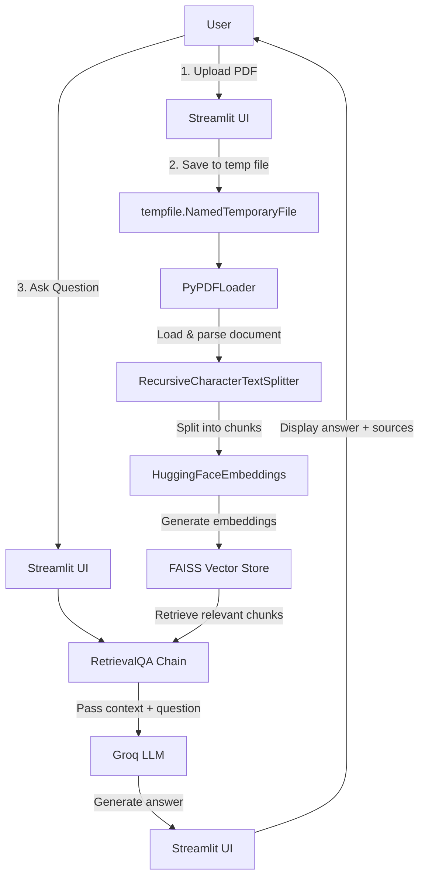

# AskDocs: RAG-Powered Document Q&A Chatbot

<div align="center">

[](https://www.python.org/downloads/)
[](https://streamlit.io)
[](https://langchain.com)
[](LICENSE)

</div>

## Project Overview

AskDocs is a lightweight, production-ready Retrieval-Augmented Generation (RAG) application that allows users to upload PDF documents and ask natural language questions about their content. The application uses semantic search to find relevant document sections and AI-powered LLM to generate accurate, contextual answers.

### Core Features

| Feature | Description |
|---------|-------------|
| PDF Document Upload | Drag-and-drop interface for easy file upload |
| Semantic Search | Finds relevant document context using FAISS vector store |
| AI-Powered Answers | Uses Groq's Llama 3.1 model for fast, intelligent responses |
| Source Citations | Shows exactly which pages and sections answers come from |
| Chat History | Maintains conversation context across interactions |
| Clean UI | Modern, user-friendly Streamlit interface |
| Real-time Processing | Spinner indicator while AI processes your question |

### Technical Stack

| Layer | Technologies |
|-------|--------------|
| **Frontend/UI** | Streamlit |
| **LLM Orchestration** | LangChain, LangChain Classic |
| **LLM Provider** | Groq API |
| **Model** | Llama 3.1 8B Instant |
| **Embeddings** | Hugging Face (all-MiniLM-L6-v2) |
| **Vector Store** | FAISS |
| **Document Loading** | PyPDF |
| **Text Processing** | LangChain Text Splitters |

## Architecture Overview



## Folder Structure

```
AskDocs/
├── app.py                      # Main Streamlit application
├── requirements.txt            # Project dependencies
├── .gitignore                  # Git ignore rules
├── README.md                   # This file
├── config/
│   └── settings.py             # Configuration and environment variables
└── core/
    ├── loader.py               # PDF loading and chunking
    ├── embeddings.py           # Embedding model initialization
    ├── vectorstore.py          # FAISS vector store creation
    └── chain.py                # RetrievalQA chain construction
```

## Module Breakdown

### config/settings.py
Centralized configuration management:
- **Environment loading**: Loads variables from `.env` file
- **API key validation**: Raises ValueError if GROQ_API_KEY is missing
- **Model settings**: Configurable chunk size, overlap, and embedding model

### core/loader.py
Responsible for document processing:
- **PDF loading**: Uses PyPDFLoader to extract text
- **Text splitting**: RecursiveCharacterTextSplitter (500 char chunks, 50 char overlap)

### core/embeddings.py
Embedding model initialization:
- Uses `all-MiniLM-L6-v2` for fast, efficient embeddings

### core/vectorstore.py
Vector store and retriever setup:
- Creates FAISS index from document chunks
- Returns retriever object for semantic search

### core/chain.py
QA chain construction:
- Strict prompt template to ensure answers only come from document context
- Returns source documents for citation
- Handles unanswerable questions gracefully

### app.py
Main application:
- Streamlit UI and state management
- Chat history tracking
- Question answering workflow
- Source citation display

## Installation & Configuration

### Prerequisites

- Python 3.9 or higher
- Groq API key (get one at [console.groq.com](https://console.groq.com))

### Step 1: Clone or Download the Project

```powershell
cd c:\Users\yashk\Desktop\AskDocs
```

### Step 2: Create a Virtual Environment (Recommended)

```powershell
# Create virtual environment
python -m venv venv

# Activate virtual environment
.\venv\Scripts\activate
```

### Step 3: Install Dependencies

```powershell
pip install -r requirements.txt
```

### Step 4: Configure Environment Variables

Create a `.env` file in the project root directory:

```env
GROQ_API_KEY=your_groq_api_key_here
```

**Important**: Replace `your_groq_api_key_here` with your actual Groq API key.

## Running the Application

### Development Mode

```powershell
streamlit run app.py
```

The application will start and automatically open in your default browser at `http://localhost:8501`.

### Usage Instructions

1. Upload a PDF document using the file uploader
2. Wait for the "PDF loaded. Ask your question below." success message
3. Type your question in the chat input box
4. Wait for the AI to process and respond
5. View the answer and click "📄 View Sources" to see citations

## API Documentation

This application is a Streamlit web app and doesn't expose a traditional REST API. However, below is documentation of the core internal modules:

### core.loader.load_and_chunk_pdf(file_path)
Loads and chunks a PDF document.

**Parameters:**
- `file_path` (str): Path to the PDF file

**Returns:**
- `List[Document]`: List of LangChain Document objects

**Example:**
```python
from core.loader import load_and_chunk_pdf
chunks = load_and_chunk_pdf("document.pdf")
```

---

### core.embeddings.get_embeddings()
Returns the configured embedding model.

**Returns:**
- `HuggingFaceEmbeddings`: Embedding model instance

**Example:**
```python
from core.embeddings import get_embeddings
embeddings = get_embeddings()
```

---

### core.vectorstore.build_vectorstore(chunks, embeddings)
Creates a FAISS vector store and returns a retriever.

**Parameters:**
- `chunks` (List[Document]): Document chunks from load_and_chunk_pdf
- `embeddings` (HuggingFaceEmbeddings): Embedding model from get_embeddings

**Returns:**
- `VectorStoreRetriever`: Configured retriever object

**Example:**
```python
from core.vectorstore import build_vectorstore
retriever = build_vectorstore(chunks, embeddings)
```

---

### core.chain.build_qa_chain(retriever)
Builds the RetrievalQA chain.

**Parameters:**
- `retriever` (VectorStoreRetriever): Retriever from build_vectorstore

**Returns:**
- `RetrievalQA`: Configured QA chain that accepts {"query": "..."}

**Example:**
```python
from core.chain import build_qa_chain
qa_chain = build_qa_chain(retriever)
response = qa_chain.invoke({"query": "What is this document about?"})
```

**Response Format:**
```python
{
    "query": "What is this document about?",
    "result": "This document discusses...",
    "source_documents": [Document(...), Document(...)]
}
```

## Contributing Guidelines

We welcome contributions to AskDocs! Here's how you can help:

### Development Workflow

1. **Fork the Repository**
   - Create a personal fork of the project

2. **Create a Feature Branch**
   ```powershell
   git checkout -b feature/amazing-feature
   ```

3. **Make Your Changes**
   - Follow the existing code style
   - Add comments where necessary
   - Test your changes thoroughly

4. **Commit Your Changes**
   ```powershell
   git commit -m "Add amazing feature"
   ```

5. **Push to Your Branch**
   ```powershell
   git push origin feature/amazing-feature
   ```

6. **Open a Pull Request**
   - Describe your changes in detail
   - Link any relevant issues

### Code Style Guidelines

- Follow PEP 8 guidelines
- Use meaningful variable and function names
- Keep functions focused and single-purpose
- Add docstrings for public functions

### Code of Conduct

- Be respectful and inclusive
- Welcome constructive feedback
- Focus on what's best for the community
- Show empathy towards other contributors

## License

This project is licensed under the MIT License - see the [LICENSE](LICENSE) file for details (if LICENSE file doesn't exist, you may create one).

## Version History

### v1.0.0 (Latest)

**Features:**
- Initial release of AskDocs
- PDF document upload and processing
- Semantic search with FAISS
- AI-powered answers using Groq Llama 3.1
- Source citations
- Chat history
- Clean Streamlit UI

**Improvements:**
- Refactored into modular structure (config/core separation)
- Added GROQ_API_KEY validation at startup
- Replaced hardcoded temp.pdf with tempfile.NamedTemporaryFile to prevent concurrent access conflicts
- Added graceful unanswerable question handling
- Improved UI with source expanders

**Bug Fixes:**
- Fixed indentation issues in app.py
- Removed duplicate chat history display code
- Added proper temp file cleanup

## Known Issues

| Issue | Description | Workaround |
|-------|-------------|------------|
| Single document only | Currently supports only one uploaded PDF at a time | Reload app to upload a new document |
| No persistent storage | Vector store is in-memory only | No workaround yet (future improvement) |
| Large PDFs | Very large PDFs may take time to process | Consider splitting large PDFs into smaller files |

## Future Improvements

- [ ] Support for multiple file formats (DOCX, TXT, EPUB, etc.)
- [ ] Persistent vector storage (ChromaDB, Pinecone, etc.)
- [ ] Multiple document upload and querying
- [ ] Advanced chunking strategies (semantic, hierarchical)
- [ ] Custom prompt templates
- [ ] Export chat history
- [ ] Docker containerization
- [ ] Authentication and user accounts
- [ ] Better error handling and user feedback

## Security Considerations

- **API Key Management**: GROQ_API_KEY loaded from environment variable, never hardcoded
- **Temporary File Cleanup**: Uploaded files deleted after processing using try/finally
- **Input Validation**: File uploader restricted to PDF files only
- **Prompt Injection Protection**: Strict prompt template limits model to document context only
- **Dependencies**: All dependencies listed in requirements.txt with no known vulnerabilities

## Support & Troubleshooting

### Common Issues

**"GROQ_API_KEY environment variable is required"**
- Make sure you created a `.env` file with your API key
- Restart the Streamlit app after setting the environment variable

**"No module named '...'"**
- Make sure you activated your virtual environment
- Run `pip install -r requirements.txt`

**PDF won't upload or process**
- Make sure the file is a valid PDF
- Try a different PDF file to rule out corruption

### Getting Help

If you encounter issues:
1. Check the Known Issues section above
2. Review the Streamlit terminal output for error messages
3. Open an issue in the project repository

---

<div align="center">
Made with ❤️ using Python, Streamlit, and LangChain
</div>
