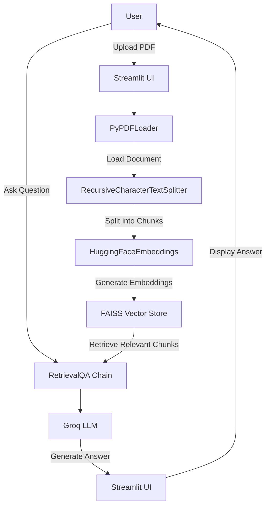

# AskDocs: RAG-Powered Document Q&A

AskDocs is a lightweight Retrieval-Augmented Generation (RAG) application built with Python and Streamlit, allowing users to upload PDF documents and get AI-powered answers about their content.

## Project Overview

This project demonstrates a practical implementation of RAG, which combines:
- **Document retrieval**: Finding relevant text chunks from uploaded PDFs
- **LLM generation**: Using Groq's Llama 3.1 model to generate contextual answers

## Problem Statement

Reading through entire documents to find specific information is time-consuming. Traditional search engines lack deep contextual understanding of document content. This application solves this by letting users ask natural language questions directly about their documents.

## Architecture Overview

Here's how the application is structured:



## Folder Structure

```
AskDocs/
├── app.py              # Main application code
├── requirements.txt    # Project dependencies
├── document.pdf        # Example PDF document
├── .gitignore          # Git ignore rules
└── README.md           # This file
```

## Module Breakdown

### app.py (Main Application)

This is the only Python file in the project, containing all the core logic.

#### Key Components:

1. **Environment & Configuration** (`lines 11-21`)
   - Loads environment variables from `.env`
   - Configures Groq API key
   - Initializes `ChatGroq` with Llama 3.1 8B Instant model

2. **Embedding Model** (`line 23`)
   - Uses `HuggingFaceEmbeddings` with `all-MiniLM-L6-v2` for efficient text embedding
   - This is a lightweight model that works well for document retrieval tasks

3. **UI Components** (`lines 25-28`)
   - Streamlit file uploader for PDFs
   - Streamlit title and success/error notifications

4. **Document Processing** (`lines 29-38`)
   - Saves uploaded file temporarily as `temp.pdf`
   - Loads PDF using `PyPDFLoader`
   - Deletes temporary file after processing (in `finally` block)

5. **Text Splitting** (`lines 40-44`)
   - Uses `RecursiveCharacterTextSplitter`
   - Chunk size: 500 characters
   - Chunk overlap: 50 characters (for context continuity)

6. **Vector Store & Retriever** (`lines 46-47`)
   - Creates FAISS vector store from document chunks and embeddings
   - Initializes retriever for semantic search

7. **QA Chain** (`lines 49-52`)
   - Creates `RetrievalQA` chain that combines retriever and LLM

8. **Question Answering** (`lines 56-63`)
   - Text input for user questions
   - Spinner while processing
   - Displays generated answer

## Dependencies

The project uses the following key libraries:

| Dependency | Purpose |
|------------|---------|
| streamlit | Web UI framework |
| python-dotenv | Load environment variables |
| langchain | Orchestration framework for LLM workflows |
| langchain-community | Community-contributed LangChain modules |
| langchain-text-splitters | Text splitting utilities |
| langchain-groq | Groq integration |
| faiss-cpu | Vector similarity search library |
| pypdf | PDF document loading |
| sentence-transformers | Embedding models |

## Engineering Decisions

1. **Vector Database Choice**: FAISS (Facebook AI Similarity Search) was selected for its speed and ease of use for small-to-medium document datasets.

2. **Text Splitting Strategy**: Recursive character-based splitting with 500-character chunks and 50-character overlap balances context retention and search accuracy.

3. **Embedding Model**: `all-MiniLM-L6-v2` is chosen for its good performance/size ratio.

4. **LLM Provider**: Groq's Llama 3.1 8B Instant is used for fast inference.

5. **Temporary File Handling**: The uploaded PDF is saved temporarily and deleted immediately after processing to avoid disk bloat.

## Configuration

Create a `.env` file in the project root:

```
GROQ_API_KEY=your_groq_api_key_here
```

## Running the Application

1. Install dependencies:
   ```powershell
   pip install -r requirements.txt
   ```

2. Set up your `.env` file with a valid Groq API key

3. Run the application:
   ```powershell
   streamlit run app.py
   ```

## Future Improvements

- Support for multiple file formats (DOCX, TXT, etc.)
- Persistent vector storage
- Chat history support
- Citation of document sources in answers
- Multiple document uploads
- Advanced chunking strategies
- Custom prompt templates
- Better error handling

## Security Considerations

- **API Key Management**: The Groq API key is loaded from an environment variable, not hardcoded
- **Temporary File Cleanup**: Uploaded PDFs are deleted after processing
- **Input Validation**: Streamlit's file uploader restricts to PDF files only

## Design Patterns Used

- **Chain of Responsibility**: LangChain's `RetrievalQA` orchestrates multiple components (retriever → LLM → answer)
- **Factory Pattern**: LangChain's `from_chain_type` and `from_documents` methods create complex objects
- **Resource Management**: `try/finally` ensures temporary files are cleaned up
